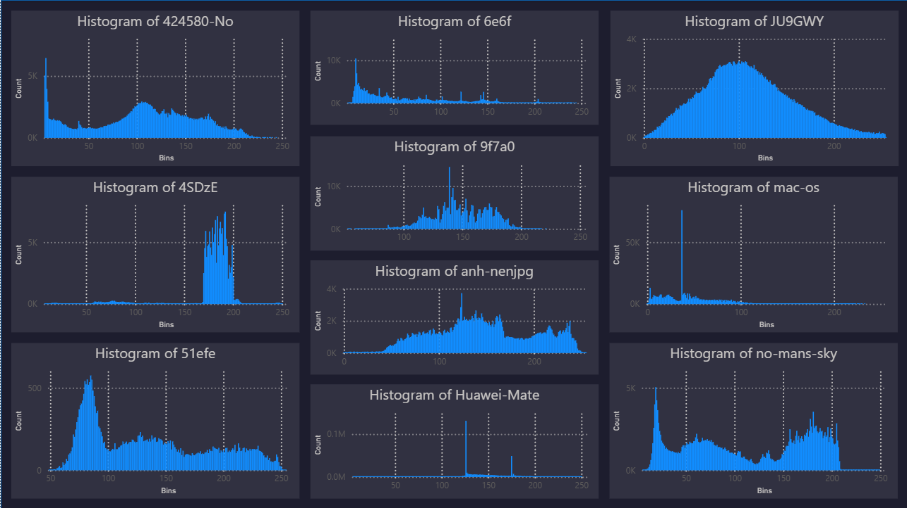

# 🖼️ Image Grayscale Analysis & Power BI Visualization  
**Author:** [Dipanshu Modi](https://github.com/dipanshumodi31)  
**Skills:** Python, Data Processing, Excel Automation, Power BI, Data Visualization  

---

## 🚀 Project Overview  
This project automates the process of **reading image files, converting them to grayscale**, and **preparing the pixel data for histogram analysis** in **Power BI**.

📌 **Project Highlights:**  
✅ Reads and processes up to **10 images** from a folder  
✅ Converts to **grayscale** and flattens pixel data  
✅ Exports to **Excel**, one sheet per image  
✅ Prepares data for **Power BI histogram creation**

🔗 **Dataset:** "input_images" Folder (JPG, PNG, JPEG format)  
📊 **Visualization Tool:** Microsoft Power BI  

---

## 🎯 Key Objectives  
✔ Automate grayscale conversion of multiple images  
✔ Export pixel intensity data to Excel for analysis  
✔ Build intuitive **histograms** in Power BI for image-level insights  
✔ Handle large image sizes gracefully (skip oversized images)  
---

## ✅ Visualisation


---

## 🧠 How the Script Works  

### 1️⃣ Image Preprocessing & Conversion  
📁 Reads up to **10 images** from the `input_images/` directory  
🎨 Converts each image to **grayscale** using **Pillow (PIL)**  
📐 Displays original vs grayscale image using `matplotlib`

```python
gray_img = original_img.convert("L")  # Convert to grayscale
plt.imshow(gray_img, cmap='gray')     # Display
```

---

### 2️⃣ Data Flattening & Export to Excel  
📉 Flattens grayscale matrices into **1D arrays**  
📏 Skips images exceeding Excel’s **1,048,576 row limit**  
📁 Saves valid grayscale data into an **Excel file** (`grayscale_matrices.xlsx`)  
📄 Each sheet = one image

```python
gray_np = np.array(gray_img).flatten()
if len(gray_np) <= 1_048_576:
    df = pd.DataFrame(gray_np, columns=["Grayscale Value"])
    df.to_excel(writer, sheet_name=img_file, index=False)
```

---

### 3️⃣ Power BI: Create a Histogram from Excel Data  
Once the Excel file is generated:

#### ✅ Step-by-Step:
1. Open **Power BI Desktop**
2. **Get Data** → Select `grayscale_matrices.xlsx`
3. Load all relevant sheets (one per image)

#### 🔧 Create Histogram:
1. In **Fields**, right-click `Grayscale Value` → **New group**
2. Set:
   - **Group Type**: *Bin*  
   - **Bin Size**: *10* (creates ranges like 0–10, 10–20, ..., 250–255)
3. Drag the **binned column** to **X-axis**  
4. Drag **count of Grayscale Value** to **Y-axis**

✅ You now have a **grayscale histogram** for each image, showing pixel intensity distributions.

---

## 📂 Directory Structure

```
├── input_images/           # Folder with input images (up to 10)
├── PowerBiOUTPUT.png       # Output of PowerBI file
├── grayscale_matrices.xlsx # Output Excel file (auto-generated)
├── image_to_excel.ipynb    # Python script
├── image_histograms.pbix   # PowerBI file
└── README.md               # This file
```

---

## 🛠 How to Run This Project  

1️⃣ Place up to **10 image files** (`.png`, `.jpg`, `.jpeg`) into `input_images/`  
2️⃣ Install required Python libraries:

```bash
pip install pillow matplotlib pandas openpyxl
```

3️⃣ Run the script:

```bash
python image_to_excel.py
```

4️⃣ Open **Power BI** and follow the steps to create histograms  

---

## 🔮 Future Enhancements  
🔹 Allow batch processing of >10 images via pagination  
🔹 Add histogram generation directly in Python using `matplotlib`  
🔹 Support saving histograms as PNGs for external reports  

---

## 📌 Why This Project Stands Out  
✔ Combines **image processing + data analytics** in a single workflow  
✔ Offers **Power BI integration** with simple histogram binning  
✔ Manages **Excel’s row limits** for large image handling  
✔ Reusable for both **scientific** and **business analytics** workflows  

---
